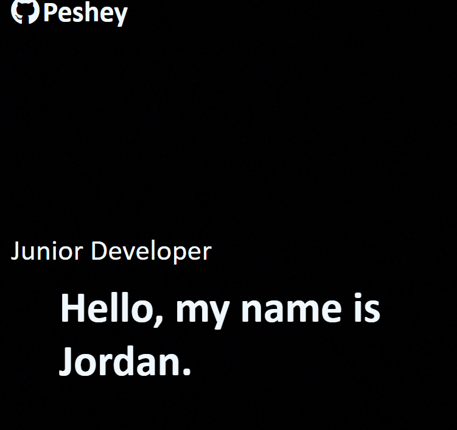

# C2-Web-Portfolio-Project

## Description

In this project I was to create a web portfolio page. Building a web portfolio is important in showcasing your work to potential employers. It also allowed me to practice what I've learned over the past few weeks and learn a few new things in the process such as creating hover effects on links and linking to external pages.

## Usage

Site is depolyed here: https://peshey.github.io/C2-Web-Portfolio-Project/

  
## Credits

Some inspiration for the page layout as well as the effects on some of the links in the nav bar and footer came from Easy Tutorials youtube video located here: https://www.youtube.com/watch?v=0YFrGy_mzjY&t=6586s

## License

This is licensed under the MIT license

---